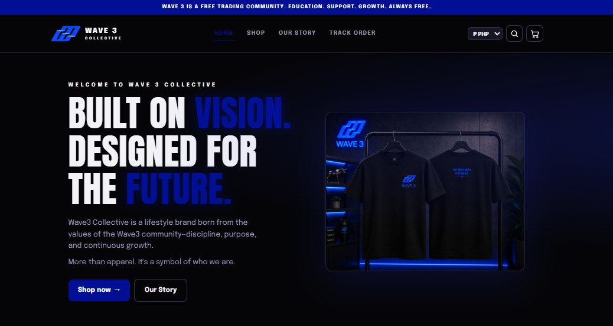
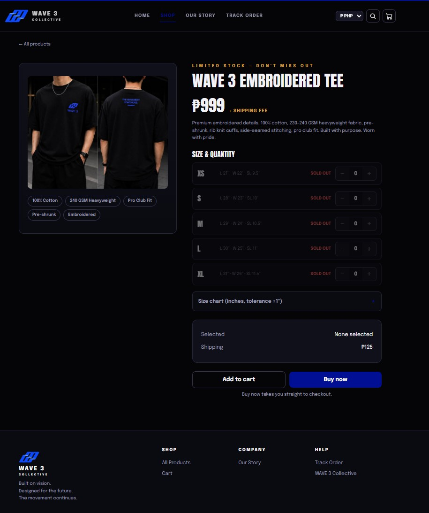
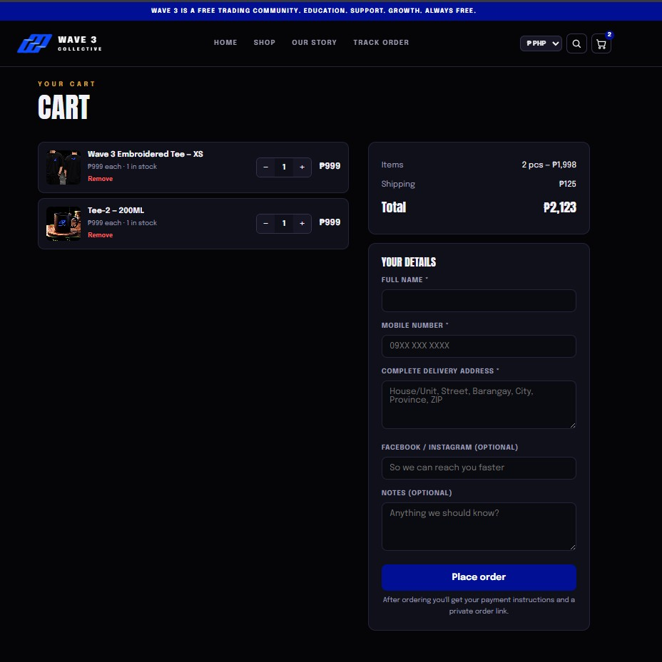
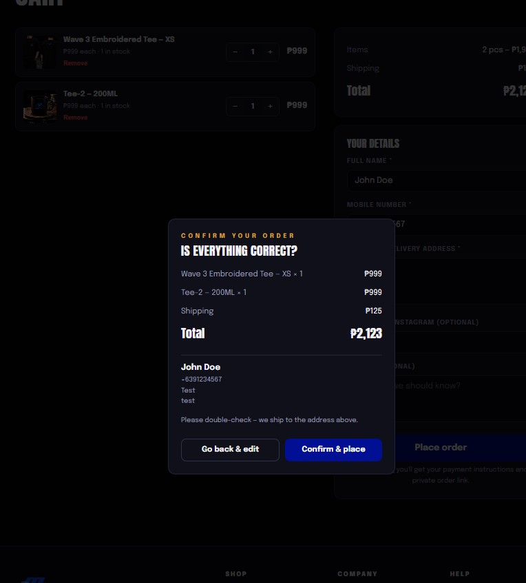
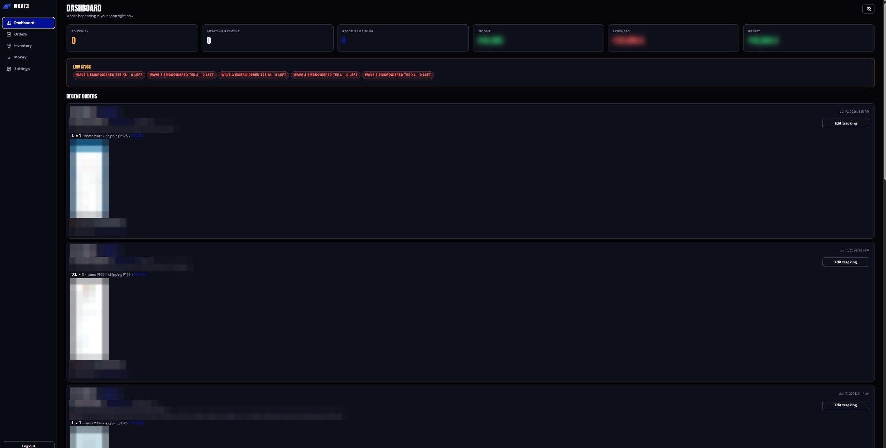
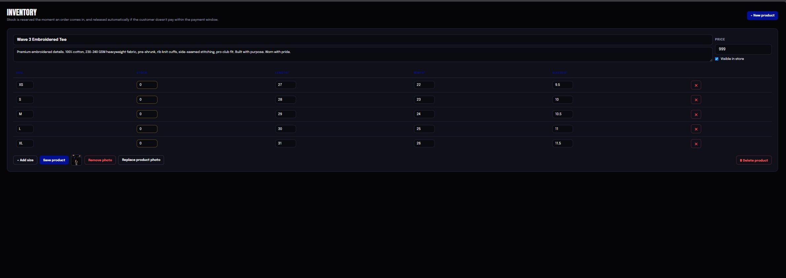
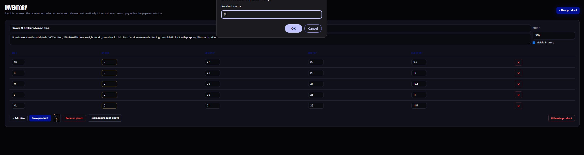
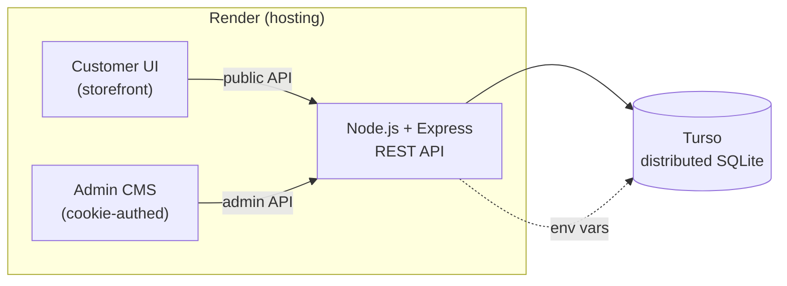
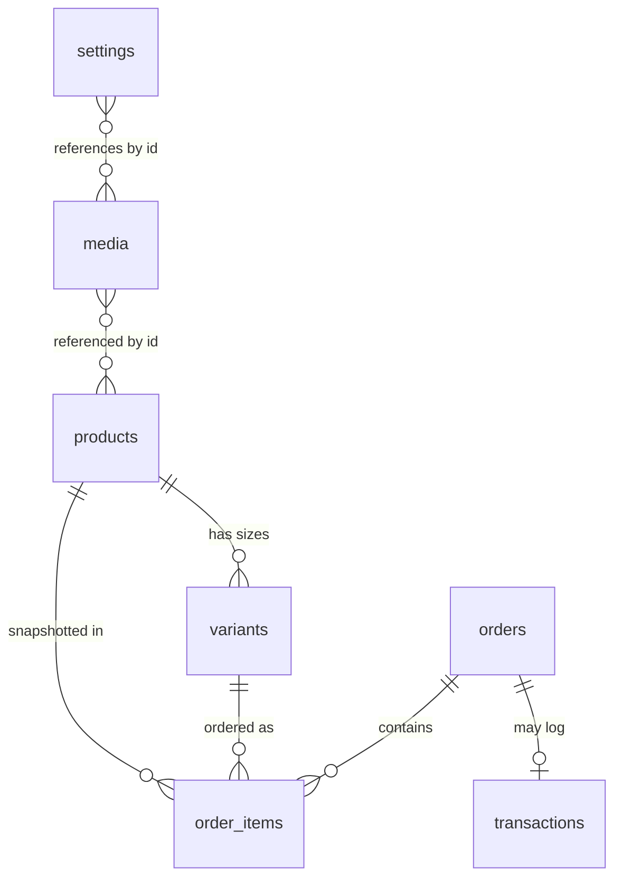

# Wave3 Collective PH

**A production e-commerce platform and custom CMS, built from scratch for a real Philippine streetwear brand — a custom alternative to Shopify, shaped around how the owner actually runs the business.**
Storefront, real-time inventory, and payment operations, run end to end by the owner without touching code.

🔗 **Live site:** [wave3collectiveph.com](https://wave3collectiveph.com)
📄 **Full case study** (engineering decisions, business impact, and results): [wave3-portfolio.netlify.app](https://wave3-portfolio.netlify.app)

> No Shopify. No WordPress. No Wix. No templates. Every line is custom.

---

> **Outcome:** Version 1 shipped to production and **sold out its first product batch** — real
> customers, real payments, real fulfillment. The owner runs the entire business through the CMS,
> day to day, with no developer in the loop.

## Why this project exists

A hosted platform like Shopify could technically sell shirts — but it wasn't the right fit for how
this business runs, for a few concrete reasons:

- **Manual payment reality.** Sales run on GCash / bank transfer with a payment-proof screenshot verified by hand — a workflow hosted checkouts aren't built around. Wave3 makes it first-class: reserve stock → upload proof → verify → approve, with a payment window that auto-expires unpaid orders and restocks them.
- **Launch before registration.** Platform fees and payment-gateway onboarding assume a registered business; the manual workflow let the store launch and sell *first*, with automated gateways designed in as a later drop-in.
- **Brand over template.** The storefront had to carry the brand's story and voice, not live inside a theme.
- **Total control, no lock-in.** Products, pricing, inventory, content, and reporting all live in a CMS the owner operates directly — no monthly platform fees, no developer in the loop.

## What it is

This isn't a website — it's the operating system for a small brand. The owner runs the entire
business through a purpose-built admin CMS without touching code: products, pricing, inventory,
orders, payments, and every page of content.

## Project preview

**Storefront**

| | |
|---|---|
|  |  |
| **Home page** | **Product page** |
|  |  |
| **Shopping cart** | **Checkout** |

**Admin CMS**

| | |
|---|---|
|  |  |
| **Dashboard** | **Inventory management** |
|  |  |
| **Product management** | **Order &amp; payment verification** |

> Customer details in the admin screenshots are intentionally blurred — this repo is public.
> The [full case study](https://wave3-portfolio.netlify.app) has the complete gallery, including mobile views.

## Features

### Storefront
- Editorial custom homepage with an interactive, expandable brand-story photo section
- Product catalog + detail pages, product search
- Multi-item shopping cart and checkout with an order-confirmation step
- **Shopee-style stock reservation** — stock is held at order time, a payment window counts down, and unpaid orders auto-expire and restock
- Payment-proof upload → owner verification → shareable receipt page with courier tracking
- Live per-size inventory, per-order shipping fees
- **Multi-currency display (PHP / USD / USDT)** with live FX conversion; records stay in the base currency
- CMS-authored brand story (blog), community links, contact channels

### Admin CMS
- **Dashboard** — orders to verify, pending payments, stock, income, expenses, net profit at a glance (with a privacy toggle that blurs figures for screenshots)
- **Product & inventory management** — add / edit / hide / delete products, per-size stock and measurements, photo uploads
- **Order operations** — verify payments, set shipping fees, add tracking, cancel/reverse (stock & books corrected automatically)
- **Money & reporting** — automatic income + shipping-expense logging on every sale, date-range reports, one-click Excel/CSV export
- **Content studio** — rich-text blog editor (fonts, colors, links, image uploads), hero-image upload, featured-product curation, homepage photo stories, payment channels with QR codes
- Manual / historical order entry, password management

## Tech stack

| Layer | Choice |
|---|---|
| Backend | Node.js + Express (REST API) |
| Frontend | Vanilla JavaScript — no framework |
| Database | [Turso](https://turso.tech) — distributed SQLite via `@libsql/client` (async) |
| Hosting | [Render](https://render.com) (auto-deploy on push) |
| DNS / domain | GoDaddy → custom domain + SSL |

**Why vanilla JS?** To prove the fundamentals — cart, currency, order lifecycle, and UI state are
managed in disciplined plain JavaScript with zero framework overhead. The result is a fast,
dependency-light app (two runtime dependencies total). It's a deliberate constraint for a project of
this size, not a limitation: a component framework would earn its keep once the UI grows shared,
stateful views, but here it would have added build tooling and weight for no user-facing benefit.

## Architecture

A single Node/Express service renders the storefront and the admin CMS from the same `public/`
directory and backs both with one REST API and one database. The storefront is public; every admin
route sits behind a session cookie.



## Engineering decisions

This project intentionally avoids frameworks and external services unless they clearly earn their
place. Each choice below traded a "default" option for less operational complexity at this scale —
without boxing in future growth:

| Chosen | Over | Why |
|---|---|---|
| Vanilla JavaScript | React / SPA framework | No shared, stateful views to justify the build tooling and bundle weight |
| SQLite / Turso | PostgreSQL | A small catalog on a single service doesn't need a separate DB server; Turso keeps it distributed and free |
| Database-backed media | S3 / object storage | Avoids a paid dependency and survives the host's ephemeral disk (detail below) |
| Single service | Microservices | One deployable unit is simpler to reason about, test, and operate solo |
| Session cookies | JWT / OAuth stack | One admin user — a signed session is enough; no third-party identity to integrate |

The guiding rule: reduce moving parts while keeping the door open to scale.

## Architecture highlights

- **Race-condition-safe inventory** — stock decrements run inside database transactions at reservation time; verified by simulating two simultaneous buyers competing for the last unit (exactly one wins, every time).
- **Built for ephemeral infrastructure** — all media (payment receipts, QR codes, product photos, blog images) is stored in the database rather than on disk, because the free hosting tier's filesystem doesn't persist between deploys. Object storage (S3/R2) is the textbook answer at scale, but for a small catalog on a zero-cost tier it would have added a paid dependency for no real gain — storing media in SQLite trades a little query weight for guaranteed durability across redeploys and keeps the whole system on one free database.
- **Self-healing bookkeeping** — every paid order auto-logs income and its exact shipping cost as an expense; an idempotent boot-time backfill safely repairs historical records.
- **Same code, two environments** — a local file-based SQLite database for development and cloud Turso in production, switched purely by environment variables.
- **Defense at both ends** — every money field and user input is validated client- and server-side; rich-text content is sanitized server-side before storage.

## Data model

Seven tables. A product has many sized `variants`; an order captures many `order_items`, each a
snapshot of the variant bought (name, size, qty, unit price) so history stays accurate even if the
product later changes. `transactions` is the ledger — sales and expenses, optionally linked back to
the order that produced them. `media` holds every uploaded image, referenced by opaque id from
products, orders, and settings. `settings` is a key/value store for all CMS-editable content.



Orders move through a lifecycle of `pending → proof → paid → shipped`, with `cancelled` and `expired`
branches — every transition keeps stock counts and the ledger consistent (a cancellation restocks and
reverses its bookkeeping; an expiry releases reserved stock automatically).

## API overview

One REST API serves both sides. Routes are grouped by audience and responsibility rather than
sprawled flat — the goal below is to show that organization, not to list every endpoint.

**Public storefront** — no auth
| Endpoint | Purpose |
|---|---|
| `GET /api/shop` | Catalog, live stock, and CMS content for the storefront |
| `POST /api/orders` · `GET /api/orders/:code` | Place an order; look one up by its public code |
| `POST /api/orders/:code/proof` | Upload payment proof for an order |
| `GET /media/:id` · `GET /qr/:id` | Serve stored images (product photos, QR codes) |

**Admin** — behind a session cookie (`/api/admin/*`)
| Group | Responsibility |
|---|---|
| `login` · `logout` · `me` | Session auth |
| `overview` · `orders` · `orders/:id/action` | Dashboard + order operations (verify, ship, cancel, reverse) |
| `inventory` · `products` · `variants` | Catalog & stock management |
| `transactions` · `report` · `export/*.csv` | Ledger, reporting, and Excel/CSV exports |
| `settings` · `media` · `password` | CMS content, image uploads, credentials |

Mutations return JSON and are validated server-side; admin writes to money, stock, and content all
run through this single guarded surface.

## Running locally

```bash
npm install
npm start          # serves on http://localhost:3737
```

With no environment variables set, the app creates and seeds a local SQLite database on first boot
(`data/wave3.db`) — no external services required. The admin dashboard lives at `/admin`.

## Deployment

Production runs on Render with a Turso database. Set two environment variables:

```
DATABASE_URL=libsql://<your-db>.turso.io
DATABASE_AUTH_TOKEN=<token>
```

First boot auto-creates the schema and seed data on an empty database. Full step-by-step instructions
are in [`DEPLOY.md`](./DEPLOY.md).

## Project structure

```
Backend
  server.js        HTTP layer — every REST route, auth guard, page-serving handler
  db.js            Data layer — schema, seeds, idempotent migrations, query helpers

Frontend  (public/ — shipped as-is, no build step)
  *.html           One file per page: home, shop, cart, order, story, track, admin
  styles.css       Shared design system
  js/              Page controllers — nav (shared), home, shop, cart, order, admin

Infrastructure
  render.yaml      Render blueprint (build + start + env)

Documentation
  DEPLOY.md        Step-by-step production setup (Render + Turso + DNS)
  docs/            Screenshots and supporting docs
```

Two files hold the whole backend: `server.js` (what the web exposes) and `db.js` (what the data
does). The frontend ships as static files with no bundler — what you read is what runs.

## Future improvements

Deliberately out of scope at current scale — the architecture leaves room for each without a rewrite:

- Move database-backed media to S3 / R2 once the catalog and traffic justify object storage
- Redis-backed reservation queues for high-concurrency drops
- Background workers for FX refresh, order expiries, and report generation
- JWT / OAuth if multi-user admin or customer accounts arrive
- Containerized deployment (Docker) for portability beyond the current host

_Product-facing roadmap — payment gateway, customer accounts, email — lives in the [case study](https://wave3-portfolio.netlify.app)._

## Lessons learned

- **Business workflows are harder than the UI.** The order lifecycle, stock reservations, and bookkeeping consistency took more design than any screen.
- **Inventory correctness beats flashy tech.** The most valuable engineering was guaranteeing two buyers can't purchase the same last unit.
- **Deployment constraints shape architecture.** An ephemeral free-tier disk is *why* media lives in the database — the environment drove the design, not the other way around.
- **Simplicity is a feature.** Fewer moving parts keeps the owner-facing system reliable and maintainable solo.

---

Designed, built, deployed, and documented by **Jhon Buerano**.
[LinkedIn](https://www.linkedin.com/in/jhon-mycho-buerano)
